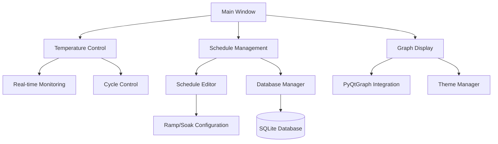

# SmartFurnace Temperature Controller

A professional PyQt5-based application for controlling and monitoring industrial furnace temperature profiles with customizable schedules.

## Features

- 🌡️ Real-time temperature monitoring and control
- 📊 Interactive temperature profile graphs
- 📋 Customizable heating schedules:
  - Ramp cycles (linear temperature increase)
  - Soak cycles (temperature maintenance)
- 🎨 Multiple theme options:
  - Light Industrial
  - Dark Industrial
  - Industrial Blue
- 💾 Persistent schedule storage with SQLite
- ⚡ Real-time graph updates
- 🔄 Automatic cycle progression

## System Architecture

## Prerequisites

- Python 3.8 or higher
- PyQt5
- pyqtgraph
- SQLite3

## Version
Current version: 1.0.0

## Installation

1. For developers:
   ```bash
   # Clone the repository
   git clone https://github.com/yourusername/SmartFurnace.git
   cd SmartFurnace

   # Build executable
   .\build.bat
   ```

2. For users:
   Download the latest release from the releases page.

## Usage

### Creating a Schedule

1. Select "Add Schedule" from the dropdown menu
2. Click "Add Row" to add temperature cycles
3. For each cycle:
   - Select cycle type (Ramp/Soak)
   - Set start temperature (default: 25°C)
   - Set end temperature
   - Enter cycle time (HH:MM:SS)
   - Add optional notes
4. Click "Save" and enter schedule name

### Running a Schedule

1. Select schedule from dropdown menu
2. Click "Start Cycle" to begin
3. Monitor:
   - Current temperature
   - Progress on graph
   - Start/End times
   - Cycle progression

### Managing Schedules

- **Edit**: Right-click schedule name → Edit
- **Delete**: Right-click schedule name → Delete
- **Save As**: Create copy with new name
- **Update**: Modify existing schedule

## Development

### Project Structure

```
SmartFurnace/
├── Main.py              # Application entry point
├── database.py          # Database operations
├── schedule_window.py   # Schedule editor
├── styles.py           # Theme management
├── constants.py         # Configuration
├── custom_combobox.py   # UI components
└── requirements.txt     # Dependencies
```

### Code Examples

#### Creating a New Schedule
```python
def save_as_schedule(self):
    try:
        name, ok = QInputDialog.getText(self, 'Save Schedule', 'Enter schedule name:')
        if ok and name:
            entries = self.validate_and_collect_entries()
            if entries and DatabaseManager.save_schedule(name, entries):
                QMessageBox.information(self, "Success", SUCCESS_MESSAGES['save_success'])
                self.parent().update_schedule_menu()
                self.accept()
    except Exception as e:
        QMessageBox.critical(self, "Error", f"Failed to save schedule: {str(e)}")
```

#### Temperature Monitoring
```python
def update_graph(self):
    elapsed_time = (datetime.now() - self.start_cycle_time).total_seconds() / 60
    self.plot_widget.clear()
    self.regenerate_graph()
    
    # Add current time line
    self.plot_widget.addLine(
        x=elapsed_time, 
        pen=pg.mkPen(theme['current_time'], width=2, style=Qt.DashLine)
    )

    # Update temperature display
    current_temp = self.get_current_temperature(elapsed_time)
    self.temp_display.setText(f"{current_temp:03d}°C")
```

### Building from Source

1. Install development dependencies:
```bash
pip install pyinstaller
```

2. Build executable:
```bash
pyinstaller --onefile Main.py
```

## Contributing

1. Fork the repository
2. Create feature branch
3. Commit changes
4. Push to branch
5. Create Pull Request

## License

This project is licensed under the MIT License - see the LICENSE file for details.

## Acknowledgments

- PyQt5 for the UI framework
- PyQtGraph for real-time plotting
- SQLite for data storage

## Support

For issues and feature requests, please use the GitHub issue tracker.